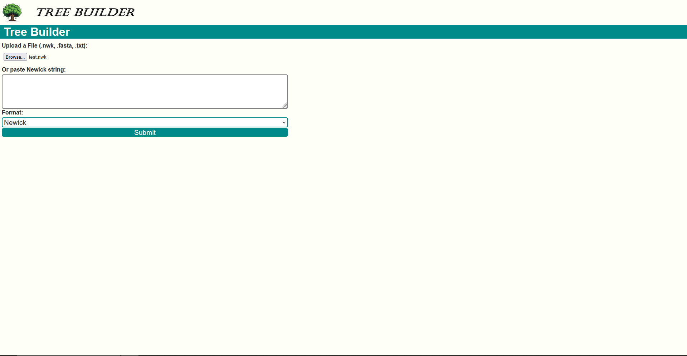
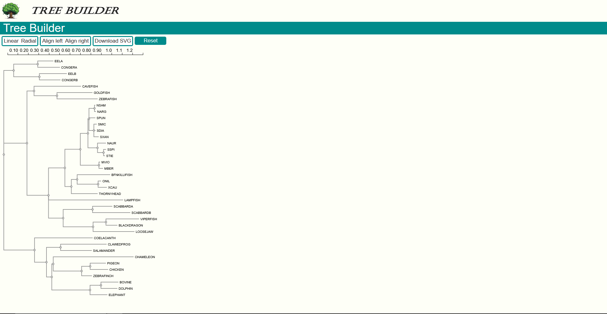

# Tree-builder
A website that visualizes a phylogenetic tree

# How to install
To install this package please clone the github link using the command: `git clone https://github.com/JoshuaTolhuis/Tree-builder.git`.
After cloning the github some extra packages need to be manually installed.
First of all make sure Node.js is installed on your pc, this can be checked with `-v node`.
After Node.js is installed install some required node packages. This can be done using the `npm install` command.
These packages are: 
* Express.js  
* Phylotree.js  
* Pug.js  

For example:  
`npm install Express.js`

# How to run
In order to run the webpage please open up the commandline and navigate to the location of the installed github folder.
When located within the github folder run the command `node index.js`. This should start the webpage on https://localhost:3000.  

# How to use
After the code has been started. The user can go to https://localhost:3000.  
The user should be greeted with this view:  

From here the user can insert the file of their choosing: Newick, Fasta or txt Files work with this setup. 
*important* dont forget to select the right corresponding type with the selection button when using a file as input.  

It is also possible to insert a text inside the text field, do note this only responds to Newick type texts.  

After the file has been sent the user will be greeted with a rendered tree of their file/text.  
It should look like something like this:  

The buttons work as follows from left to right:
- Linear, creates a linear tree (this is default).  
- Radial, creates a circulair tree.  
- Align left, creates a tree aligned to the left (this is default).  
- Align right, creates a tree aligned to the right.  
- Download, downloads a copy of the rendered tree.  
- Reset, resets the tree back to it's origin. (might be useful when having deleted several nodes).  

# Dependencies.
In order to use this program this user needs to have installed before:
* A web browser of your choice.
* Node.js

And if developing the user might want to install:
* nodemon.js
